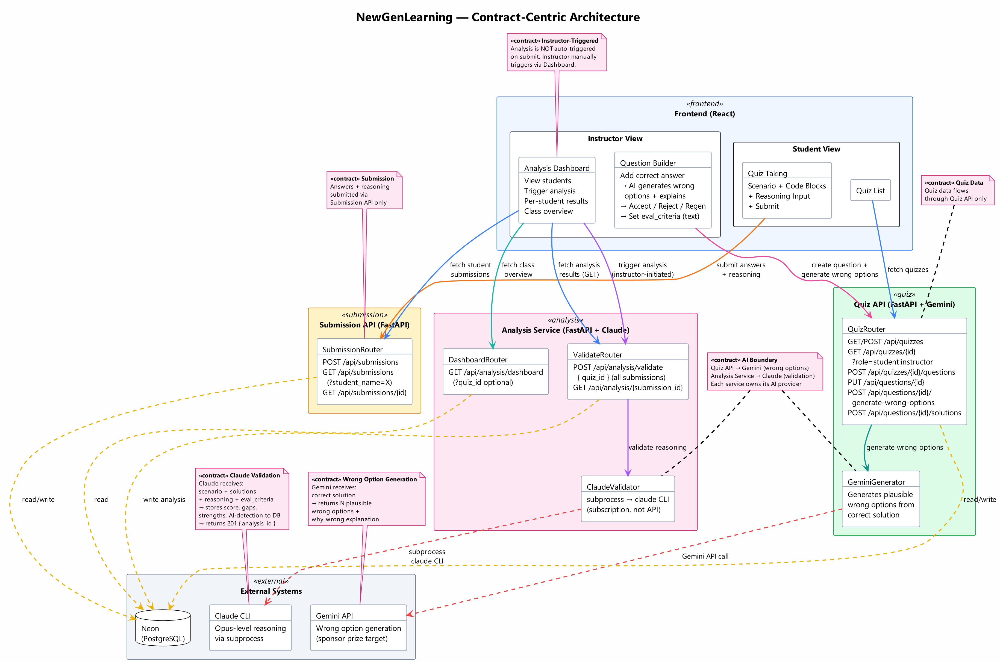

# NewGenLearning — Architecture Contract

## Overview

Reasoning-first code assessment platform. Students evaluate code solutions and explain their reasoning. AI validates understanding and provides actionable insights to instructors.

- **Team**: 2 members
- **Hackathon**: ConHacks 2026

---

## System Architecture



> Source: [architecture-contract.puml](architecture-contract.puml)

---

## Services

### 1. Frontend (React)

All UI. Two views: Student and Instructor.

**Student View**:

| Page | Description |
|------|-------------|
| Quiz List | Browse available assessments |
| Quiz Taking | Read scenario, compare code blocks, select best, write reasoning |

**Instructor View**:

| Page | Description |
|------|-------------|
| Question Builder | Write scenario + correct answer, AI generates wrong options (accept/reject/regen) |
| Analysis Dashboard | View students, trigger analysis, view per-student results, class overview |
| Criteria Editor | Write `eval_criteria` text per question — injected into Claude prompt |

### 2. Quiz API (FastAPI + Gemini)

Owns quizzes, questions, solutions. Calls Gemini for wrong option generation.

| Method | Endpoint | Description |
|--------|----------|-------------|
| GET | `/api/quizzes` | List quizzes |
| POST | `/api/quizzes` | Create quiz |
| GET | `/api/quizzes/{id}` | Get quiz + questions + solutions (`?role=student` hides is_correct, why_wrong) |
| POST | `/api/quizzes/{id}/questions` | Add question with correct solution |
| PUT | `/api/questions/{id}` | Update question |
| POST | `/api/questions/{id}/generate-wrong-options` | Gemini generates wrong options |
| POST | `/api/questions/{id}/solutions` | Save accepted wrong option |

### 3. Submission API (FastAPI)

Owns submissions and answers.

| Method | Endpoint | Description |
|--------|----------|-------------|
| POST | `/api/submissions` | Submit answers + reasoning |
| GET | `/api/submissions` | List submissions (`?student_name=X`) |
| GET | `/api/submissions/{id}` | Get single submission with answers |

### 4. Analysis Service (FastAPI + Claude)

Reasoning validation only. Calls Claude CLI via subprocess. Stores results to DB.

| Method | Endpoint | Description |
|--------|----------|-------------|
| POST | `/api/analysis/validate` | Validate all submissions for quiz `{ quiz_id }` → store to DB (201) |
| GET | `/api/analysis/{submission_id}` | Get stored analysis results |
| GET | `/api/analysis/dashboard` | Aggregated class overview (optional `?quiz_id=X`) |

---

## AI Providers

Each service owns its own AI provider. No cross-service AI calls.

| Service | AI Provider | How | Purpose |
|---------|-------------|-----|---------|
| Quiz API | Gemini API | API call | Generate plausible wrong options from correct solution |
| Analysis Service | Claude CLI | `subprocess` (subscription, not API) | Validate reasoning, detect AI-generated, apply eval_criteria |

---

## Use Cases

Sequence diagrams for each use case:

| UC | Name | Diagram | Description |
|----|------|---------|-------------|
| UC1 | Instructor creates question | [sequence-create-question.png](sequence-create-question.png) | Correct answer → Gemini wrong options → accept/reject/regen |
| UC2 | Student takes quiz | [sequence-student-takes-quiz.png](sequence-student-takes-quiz.png) | Browse → take quiz → submit reasoning |
| UC3 | AI validates submission | [sequence-ai-validates.png](sequence-ai-validates.png) | Instructor triggers → Claude analyzes → stores to DB |
| UC4 | Instructor views dashboard | [sequence-instructor-dashboard.png](sequence-instructor-dashboard.png) | View students → trigger analysis → view results → class overview |

### Key Flow Decisions

- **Analysis is instructor-triggered** (UC3) — not automatic on submit. Reduces complexity.
- **UC3 stores results only** — returns `201 Created { analysis_id }`. Does not return full results.
- **UC4 reads results via GET** — `GET /api/analysis/{submission_id}` retrieves stored analysis.

---

## Tech Stack

| Layer | Technology | Why |
|-------|-----------|-----|
| Frontend | React (Vite) | Component-based, fast dev |
| Quiz API | FastAPI (Python) | CRUD + Gemini integration |
| Submission API | FastAPI (Python) | Lightweight CRUD |
| Analysis Service | FastAPI (Python) | Claude subprocess, async |
| AI Primary | Claude CLI (subprocess) | Free via subscription, best reasoning |
| AI Secondary | Gemini API | Sponsor prize, wrong option generation |
| Database | Neon (PostgreSQL) | Serverless, shared across services |

---

## Database

> Full schema: [DATABASE.md](DATABASE.md)

**7 tables, 3 service owners:**

| Owner | Tables |
|-------|--------|
| Quiz API | `quizzes`, `questions`, `solutions` |
| Submission API | `submissions`, `answers` |
| Analysis Service | `analyses`, `answer_analyses` |

Single shared Neon (PostgreSQL) database. Each service connects via `DATABASE_URL`.

---

## Project Structure

```
ConHaccMania/
├── src/
│   ├── frontend/              # React (Vite)
│   ├── quiz-api/              # FastAPI + Gemini
│   ├── submission-api/        # FastAPI
│   └── analysis-service/      # FastAPI + Claude CLI
├── docs/                      # Architecture, DB, sequence diagrams
├── web-ui/                    # eConestoga mock (optional)
├── mock-web-ui-eConestoga/    # Original reference
└── README.md
```

---

## Hackathon Scope — MVP

### Must Have

1. Student takes quiz (scenario + code blocks + reasoning) → submit
2. Instructor triggers AI validation → Claude analyzes reasoning → results stored
3. Instructor views per-student analysis (scores, strengths, gaps, AI-detection)
4. End-to-end working flow

### Should Have

5. AI-assisted wrong option generation (Gemini API → sponsor prize)
6. Instructor-defined `eval_criteria` per question

### Nice to Have

- eConestoga-style UI shell
- Class overview dashboard (aggregated stats)
- Multiple quizzes
