# NewGenLearning — Architecture Contract

## Overview

Reasoning-first code assessment platform. Students evaluate code solutions and explain their reasoning. AI validates understanding and provides actionable insights to instructors.

## Team

- 2 members
- Hackathon: ConHacks 2026

---

## System Architecture

```
┌───────────────────────────────────────────────────────────┐
│                      Frontend (React)                      │
│                                                             │
│  Student View                    Instructor View            │
│  ┌─────────┐ ┌──────────────┐   ┌────────────────────────┐│
│  │Quiz List│→│Quiz Taking   │   │ Question Builder       ││
│  │         │ │- Scenario    │   │ - Add correct answer   ││
│  │         │ │- Code blocks │   │ - AI generates wrong   ││
│  │         │ │- Reasoning   │   │   options + explains   ││
│  │         │ │  input       │   │ - Accept/Reject/Regen  ││
│  └─────────┘ └──────┬───────┘   ├────────────────────────┤│
│                      │           │ Analysis Dashboard     ││
│                      │           │ - Per-student results  ││
│                      │           │ - Knowledge gap report ││
│                      │           │ - AI-generated flags   ││
│                      │           │ - Custom eval criteria ││
│                      │           └────────────────────────┘│
└──────────────────────┼────────────────────────────────────┘
                       │
          ┌────────────┼────────────────┐
          │            │                │
          ▼            ▼                ▼
┌──────────────┐ ┌───────────┐ ┌─────────────────────┐
│ Quiz API     │ │Submission │ │ Analysis Service     │
│ (REST + AI)  │ │API (REST) │ │ (FastAPI + AI)       │
│              │ │           │ │                       │
│ CRUD quizzes │ │ Submit    │ │ Validate reasoning    │
│ CRUD questions│ │ answers  │ │ Generate distractors  │
│              │ │ + reason  │ │ AI-detection          │
│              │ │           │ │ Custom criteria eval   │
└──────┬───────┘ └───────────┘ └───────────┬───────────┘
       │                                    │
       │    ┌───────────────────────────┐   │
       └───→│ AI Distractor Generation  │←──┘
             │ Quiz API requests         │
             │ Analysis Service executes │
             └─────────┬─────────────────┘
                       │
          ┌────────────┼──────────────┐
          │            │              │
          ▼            ▼              ▼
   ┌──────────────┐ ┌──────────────┐ ┌──────────┐
   │ Claude CLI   │ │ Gemini API   │ │ SQLite   │
   │ (subprocess) │ │ (sponsor)    │ │ (DB)     │
   │ subscription │ │              │ │          │
   └──────────────┘ └──────────────┘ └──────────┘
```

### Contract-Centric Diagram

> See also: [architecture-contract.puml](architecture-contract.puml) → [architecture-contract.png](architecture-contract.png)

```mermaid
flowchart LR
    classDef iface    fill:#dbeafe,stroke:#2563eb,color:#1e3a8a
    classDef cls      fill:#dcfce7,stroke:#16a34a,color:#14532d
    classDef abs      fill:#fef3c7,stroke:#d97706,color:#78350f
    classDef contract fill:#fce7f3,stroke:#db2777,color:#831843

    subgraph Frontend["Frontend (React)"]
        subgraph StudentView["Student View"]
            QuizList(["«interface»<br/>QuizList<br/>GET /api/quizzes"]):::iface
            QuizTaking(["«interface»<br/>QuizTaking<br/>scenario + code blocks<br/>+ reasoning input"]):::iface
            SubmitConfirm(["«interface»<br/>SubmissionConfirm"]):::iface
        end
        subgraph InstructorView["Instructor View"]
            QuestionBuilder(["«interface»<br/>QuestionBuilder<br/>correct answer → AI<br/>generates distractors"]):::iface
            Dashboard(["«interface»<br/>AnalysisDashboard<br/>per-student insights<br/>+ knowledge gaps"]):::iface
            CriteriaEditor(["«interface»<br/>CriteriaEditor<br/>focus areas + weights"]):::iface
        end
    end

    C_QuizData{{"«contract»<br/>Quiz data flows through<br/>Quiz API only"}}:::contract
    C_SubmissionData{{"«contract»<br/>Answers + reasoning<br/>submitted via<br/>Submission API only"}}:::contract
    C_AIBoundary{{"«contract»<br/>Only Analysis Service<br/>talks to AI providers"}}:::contract
    C_CriteriaInjection{{"«contract»<br/>Instructor criteria<br/>injected into<br/>AI validation prompt"}}:::contract

    subgraph QuizAPI["Quiz API (REST + AI-assisted)"]
        QuizRouter["«class»<br/>QuizRouter<br/>GET/POST /api/quizzes<br/>POST /api/quizzes/:id/questions<br/>PUT /api/questions/:id"]:::cls
        C_QuizAI{{"«contract»<br/>Question creation can<br/>request AI distractor<br/>generation via<br/>Analysis Service"}}:::contract
    end

    subgraph SubmissionAPI["Submission API (REST)"]
        SubmissionRouter["«class»<br/>SubmissionRouter<br/>POST /api/submissions<br/>GET /api/submissions?quiz_id<br/>GET /api/submissions/:id"]:::cls
    end

    subgraph AnalysisService["Analysis Service (FastAPI + Python)"]
        ValidateRouter["«class»<br/>ValidateRouter<br/>POST /api/analysis/validate<br/>GET /api/analysis/:submission_id"]:::cls
        GenerateRouter["«class»<br/>GenerateRouter<br/>POST /api/analysis/<br/>generate-distractors"]:::cls
        DashboardRouter["«class»<br/>DashboardRouter<br/>GET /api/analysis/<br/>dashboard?quiz_id"]:::cls

        C_Validation{{"«contract»<br/>Claude receives: scenario<br/>+ solutions + reasoning<br/>+ criteria → returns<br/>score, gaps, strengths,<br/>AI-detection flag"}}:::contract
        C_Distractor{{"«contract»<br/>Gemini receives:<br/>correct solution →<br/>returns N plausible<br/>wrong options +<br/>why_wrong explanation"}}:::contract

        ClaudeValidator[["«abstract»<br/>ClaudeValidator<br/>subprocess → claude CLI<br/>(subscription, not API)"]]:::abs
        GeminiGenerator[["«abstract»<br/>GeminiGenerator<br/>Gemini API call<br/>(sponsor prize target)"]]:::abs
    end

    subgraph External["External Systems"]
        ClaudeCLI["«class»<br/>Claude CLI<br/>Opus-level reasoning<br/>via subprocess"]:::cls
        GeminiAPI["«class»<br/>Gemini API<br/>distractor generation"]:::cls
        SQLite["«class»<br/>SQLite<br/>quizzes, submissions,<br/>analysis results"]:::cls
    end

    QuizList -- "fetch quizzes" --> C_QuizData
    C_QuizData -- "serves quiz + questions" --> QuizRouter
    QuizTaking -- "submit answers + reasoning" --> C_SubmissionData
    C_SubmissionData -- "stores submission" --> SubmissionRouter
    SubmitConfirm -. "triggers validation" .-> ValidateRouter

    QuestionBuilder -- "request distractors" --> C_AIBoundary
    C_AIBoundary -- "only AI gateway" --> GenerateRouter
    QuizRouter -- "needs AI distractors" --> C_QuizAI
    C_QuizAI -. "calls Analysis Service" .-> GenerateRouter
    GenerateRouter -- "generate wrong options" --> C_Distractor
    C_Distractor -- "call Gemini" --> GeminiGenerator
    GeminiGenerator -. "API call" .-> GeminiAPI

    CriteriaEditor -- "set focus + weights" --> C_CriteriaInjection
    C_CriteriaInjection -- "enrich prompt" --> ValidateRouter

    ValidateRouter -- "validate reasoning" --> C_Validation
    C_Validation -- "subprocess call" --> ClaudeValidator
    ClaudeValidator -. "CLI invocation" .-> ClaudeCLI

    Dashboard -- "fetch results" --> DashboardRouter

    QuizRouter -. "read/write" .-> SQLite
    SubmissionRouter -. "read/write" .-> SQLite
    DashboardRouter -. "read" .-> SQLite

    linkStyle 0,1 stroke:#3b82f6,stroke-width:2px
    linkStyle 2,3 stroke:#f97316,stroke-width:2px
    linkStyle 4 stroke:#ef4444,stroke-width:2px,stroke-dasharray:5
    linkStyle 5,6 stroke:#ec4899,stroke-width:2px
    linkStyle 7,8 stroke:#14b8a6,stroke-width:2px
    linkStyle 9,10 stroke:#0d9488,stroke-width:2px
    linkStyle 11 stroke:#ef4444,stroke-width:2px,stroke-dasharray:5
    linkStyle 12,13 stroke:#a855f7,stroke-width:2px
    linkStyle 14,15 stroke:#a855f7,stroke-width:2px
    linkStyle 16 stroke:#ef4444,stroke-width:2px,stroke-dasharray:5
    linkStyle 17 stroke:#14b8a6,stroke-width:2px
    linkStyle 18,19,20 stroke:#eab308,stroke-width:2px,stroke-dasharray:5
```



---

## Services

### 1. Frontend — React

All UI. eConestoga shell is optional/demo-only. Everything can be built in React.

**Student Pages**:

| Page                    | Description                              |
| ----------------------- | ---------------------------------------- |
| Quiz List               | Available assessments                    |
| Quiz Taking             | Scenario + code blocks + reasoning input |
| Submission Confirmation | After submit                             |

**Instructor Pages**:

| Page               | Description                                             |
| ------------------ | ------------------------------------------------------- |
| Question Builder   | Create questions with AI-assisted distractor generation |
| Analysis Dashboard | Per-student AI analysis, knowledge gaps, flags          |
| Criteria Editor    | Define what concepts/weights to evaluate                |

### 2. Quiz API (REST — lightweight)

Simple CRUD. Can be Node/Express or FastAPI — separate from Analysis.

```
GET    /api/quizzes                    → List quizzes
POST   /api/quizzes                    → Create quiz (instructor)
GET    /api/quizzes/{id}               → Get quiz + questions
POST   /api/quizzes/{id}/questions     → Add question
PUT    /api/questions/{id}             → Update question
```

### 3. Submission API (REST — lightweight)

```
POST   /api/submissions                → Submit answers + reasoning
GET    /api/submissions?quiz_id=X      → List submissions (instructor)
GET    /api/submissions/{id}           → Get single submission
```

### 4. Analysis Service — FastAPI (Python)

The only service that talks to AI. Handles all AI-powered features.

```
# Reasoning Validation
POST   /api/analysis/validate          → Validate a submission's reasoning
GET    /api/analysis/{submission_id}   → Get analysis results

# Question Generation (Instructor Tool)
POST   /api/analysis/generate-distractors
       Body: { scenario, correct_solution, language, count: 3 }
       Returns: { distractors: [{ code, why_wrong, hint }] }

# Instructor Dashboard
GET    /api/analysis/dashboard?quiz_id=X  → Aggregated results
```

**AI Features**:

| Feature               | AI Provider | Description                                       |
| --------------------- | ----------- | ------------------------------------------------- |
| Reasoning Validation  | Claude CLI  | Score reasoning, find gaps, detect AI-written     |
| Distractor Generation | Gemini API  | Generate plausible wrong answers from correct one |
| Custom Criteria Eval  | Claude CLI  | Evaluate based on instructor-defined priorities   |

---

## AI Workflows

### Workflow 1: Reasoning Validation (Claude CLI)

```
Student submits reasoning
        ↓
Analysis Service builds prompt:
  - Question scenario
  - All solutions
  - Student's pick + reasoning
  - Instructor's evaluation criteria (if set)
        ↓
Claude CLI subprocess → structured JSON response
        ↓
Store analysis → return to instructor dashboard
```

### Workflow 2: Distractor Generation (Gemini API)

```
Instructor provides:
  - Scenario description
  - Correct solution (code)
  - Language
        ↓
Gemini generates N wrong solutions:
  - Plausible but flawed code
  - Explanation: WHY it's wrong
  - Hint label (e.g., "Off-by-one error")
        ↓
Instructor reviews:
  ✅ Accept → add to question
  ❌ Reject → discard
  🔄 Regenerate → ask Gemini again
```

### Workflow 3: Custom Evaluation Criteria

```
Instructor defines criteria per quiz:
  e.g., "Focus on: error handling, readability, Big-O analysis"
  e.g., "Weight: error handling 40%, Big-O 30%, readability 30%"
        ↓
Criteria injected into AI validation prompt
        ↓
Analysis scores reflect instructor's priorities
```

---

## Data Model

### Quiz

```json
{
  "id": "uuid",
  "title": "Assessment 1: Array Operations",
  "course": "PROG2070",
  "created_by": "instructor_id",
  "evaluation_criteria": {
    "focus_areas": ["Time Complexity", "Error Handling", "Readability"],
    "weights": { "Time Complexity": 40, "Error Handling": 30, "Readability": 30 },
    "custom_instructions": "Prioritize whether student identifies mutation side effects"
  },
  "questions": ["question_id_1", "question_id_2"]
}
```

### Question (Scenario-Based)

```json
{
  "id": "uuid",
  "quiz_id": "uuid",
  "scenario": "You are building a function that checks for duplicates...",
  "solutions": [
    {
      "label": "A",
      "code": "def has_duplicates(arr): ...",
      "language": "python",
      "hint": "Nested loop approach",
      "is_correct": false,
      "why_wrong": "O(n²) time complexity, inefficient for large arrays"
    },
    {
      "label": "B",
      "code": "def has_duplicates(arr): ...",
      "language": "python",
      "hint": "Set conversion",
      "is_correct": true,
      "why_wrong": null
    },
    {
      "label": "C",
      "code": "def has_duplicates(arr): ...",
      "language": "python",
      "hint": "Sort-first approach",
      "is_correct": false,
      "why_wrong": "Mutates original array (side effect), O(n log n) vs O(n)"
    }
  ],
  "concepts": ["Time Complexity", "Space Complexity", "Side Effects"]
}
```

### Submission

```json
{
  "id": "uuid",
  "quiz_id": "uuid",
  "student_name": "Alex Thompson",
  "submitted_at": "2026-05-03T14:34:00Z",
  "answers": [
    {
      "question_id": "uuid",
      "selected_solution": "B",
      "reasoning": "Solution B is O(n) using set(). Solution A is O(n²). Solution C mutates the input array..."
    }
  ]
}
```

### Analysis (AI Output)

```json
{
  "id": "uuid",
  "submission_id": "uuid",
  "overall_score": 86,
  "per_question": [
    {
      "question_id": "uuid",
      "score": 92,
      "concepts_identified": ["Time Complexity", "Side Effects"],
      "strengths": ["Correctly identified O(n) vs O(n²)", "Recognized mutation side effect"],
      "gaps": ["Could mention space complexity tradeoff of set()"],
      "is_ai_generated": false,
      "confidence": 0.94
    }
  ],
  "overall": {
    "strengths": ["Strong time complexity understanding"],
    "areas_for_improvement": ["Explore space-time tradeoffs"],
    "recommended_topics": ["Defensive Programming"],
    "criteria_alignment": {
      "Time Complexity": 95,
      "Error Handling": 60,
      "Readability": 80
    }
  }
}
```

---

## Tech Stack

| Layer                 | Technology                | Why                                   |
| --------------------- | ------------------------- | ------------------------------------- |
| Frontend              | React                     | Full UI, component-based              |
| Quiz + Submission API | Express (Node) or FastAPI | Lightweight CRUD                      |
| Analysis Service      | FastAPI (Python)          | AI subprocess, async                  |
| AI Primary            | Claude CLI (subprocess)   | Free via subscription, best reasoning |
| AI Secondary          | Gemini API                | Sponsor prize, distractor generation  |
| Database              | SQLite                    | Zero setup, hackathon-friendly        |

---

## File Structure

```
ConHaccMania/
├── frontend/                    # React app
│   ├── src/
│   │   ├── pages/
│   │   │   ├── QuizList.jsx
│   │   │   ├── QuizTaking.jsx
│   │   │   ├── QuestionBuilder.jsx
│   │   │   └── InstructorDashboard.jsx
│   │   ├── components/
│   │   │   ├── ScenarioCard.jsx
│   │   │   ├── CodeBlock.jsx
│   │   │   ├── ReasoningInput.jsx
│   │   │   ├── DistractorReview.jsx
│   │   │   ├── CriteriaEditor.jsx
│   │   │   └── AnalysisResult.jsx
│   │   └── App.jsx
│   └── package.json
│
├── backend/
│   ├── quiz-api/                # Quiz + Submission (lightweight)
│   │   ├── routes/
│   │   ├── data/questions.json
│   │   └── server.js (or main.py)
│   │
│   └── analysis-service/        # FastAPI + AI
│       ├── main.py
│       ├── routers/
│       │   ├── validate.py
│       │   ├── generate.py
│       │   └── dashboard.py
│       ├── services/
│       │   ├── claude_validator.py
│       │   └── gemini_generator.py
│       ├── prompts/
│       │   ├── validation_prompt.txt
│       │   └── distractor_prompt.txt
│       └── requirements.txt
│
├── web-ui/                      # eConestoga reference (optional)
├── docs/
│   └── ARCHITECTURE.md
└── README.md
```

---

## Hackathon Scope — MVP

### Must Have (Demo Day)

1. Student: Take quiz (scenario + code blocks + reasoning) → submit
2. AI: Validate reasoning, return scores + gaps (Claude CLI)
3. Instructor: View analysis dashboard with per-student insights
4. Working end-to-end flow

### Should Have

5. Instructor: AI-assisted distractor generation (Gemini API → sponsor prize)
6. Instructor: Custom evaluation criteria per quiz

### Nice to Have

- eConestoga-style UI shell
- AI-generated detection flagging
- Multiple quizzes
- Timer
